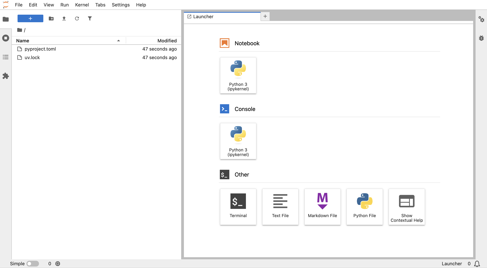
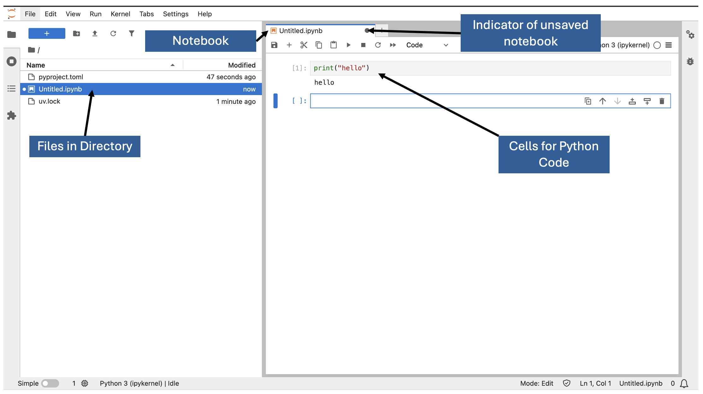

<span class="time-badge">⏱ 15 minutes</span>

Before we start, let's make sure everyone has a working Python environment with the right packages installed.


### Option A — Jupyter Notebooks (via `uv`)

Jupyter Notebooks are interactive documents that allow you to combine executable Python code, text, visuals, and equations in a single place. They run code in small, editable “cells,” making it easy to experiment, get immediate feedback, and document your reasoning as you go. This format is especially useful for learning and teaching machine learning, as it supports step‑by‑step exploration, visualisation of results, and clear explanations alongside the code.

There are several ways to install and run Jupyter Notebooks, ranging from full Python distributions like Anaconda to lightweight package managers and online platforms. For this course, we recommend using the `uv` package manager, as it provides a simple, reliable, and **reproducible** environment setup with minimal configuration.

::: {.callout-note}
### What is a package manager?

A package manager is a tool that helps you install, update, and manage software libraries (called "packages") for a programming language. For most python projects, [uv](https://docs.astral.sh/uv/) will be a great choice of package manager.
::: 

#### Install `uv`

Package manager installation should only need to be done **once** on your computer. If you encounter any issues, see [here](https://docs.astral.sh/uv/getting-started/installation/) for more installation methods to try.

::: {.panel-tabset}

### Windows

Open your Command Prompt and run:

```bat
powershell -ExecutionPolicy ByPass -c "irm https://astral.sh/uv/install.ps1 | iex"
```

### Mac

Open Terminal and run:

```bash
curl -Ls https://astral.sh/uv/install.sh | bash
```

### Linux

Open Terminal and run:

```bash
curl -Ls https://astral.sh/uv/install.sh | bash
```
:::

After installation, check that uv is available by 
typing `uv --version`, then pressing enter. You may need to restart your terminal for the changes to take effect.

#### Move into Project Directory

To set up your Python environment, you need to be in your project directory. Follow these steps:

1. Open your terminal.
2. Create or navigate to your project directory.


#### Create a Virtual Environment

Enter the following command to create a minimal virtual environment:

```bash
uv init --bare
```

This will create a `pyproject.toml` file, which will record information
on all of the packages you install in your virtual environment.

#### Install Packages

For all projects we need jupyterlab, this is
where we edit code. This can be added to your project 
with this command:

```bash
uv add jupyterlab
```

For the [Introduction to Data Analysis in Python course](https://bristol-training.github.io/data-analysis-python-1/), you would need the `pandas` and `seaborn` package. You can add these with:

```bash
uv add pandas seaborn scikit-learn
```


#### Opening JupyterLab

Now you can open JupyterLab with:

```bash
uv run jupyter lab
```

This will take some time, and you will see text being
printed in the terminal. Once JupyterLab is running, a browser
window should pop open. This window should like similar to
the image below.



#### Create a Notebook

To create a notebook, click the "Notebook" icon in the JupyterLab launcher. The window should now look like this:



In each cell, python code can be entered. It can be run by clicking the "Run" button or by pressing `Shift + Enter`.


### Option B — Google Colab (recommended)

[Google Colab](https://colab.google/) is a free, cloud‑based platform that lets you write and run Python code directly in your web browser. It provides an environment similar to Jupyter Notebooks, but without the need to install Python or any additional software on your computer. This makes it an ideal starting point for medics and healthcare professionals who want to explore machine learning without worrying about technical setup.

Colab also includes a wide range of pre‑installed scientific and machine‑learning libraries—such as NumPy, Pandas, Matplotlib, and TensorFlow—so you can focus on learning concepts rather than configuring tools. Notebooks are easy to share, collaborate on, and store in Google Drive, making it a convenient platform for both individual study and group work. With its simplicity and accessibility, Colab provides a smooth entry point into Python programming and practical machine‑learning experimentation.


If you are up for **Colab**, you can try to load the sample dataset `nhs_readmission.csv` from the course repository by running this in a new notebook cell:

```python
import pandas as pd

url = "https://raw.githubusercontent.com/Bristol-Training/nhs-data-science/refs/heads/main/data/nhs_readmission.csv"

df = pd.read_csv(
    url,
    skiprows=3,
    index_col="patient_id",
    na_values=[".", "N/A", "NULL", "UNKNOWN"],  # Add this
)

print(f"Dataset loaded: {df.shape[0]} patients, {df.shape[1]} columns")

df.head()
```
